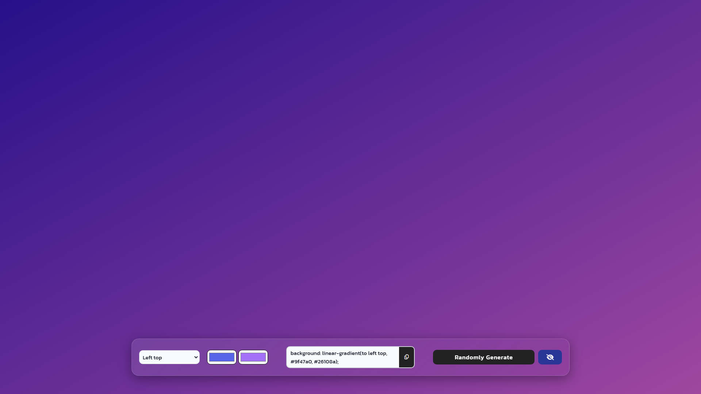

# Lume Linear Gradient Generator - [Live Demo](https://lume-generator.netlify.app/ "Live Demo")



Bu proje, basit bir linear gradient oluşturucu web uygulamasıdır. Projeyi kullanarak istediğiniz renkleri seçebilir veya "Randomly Generate" butonunu kullanarak rastgele bir gradyan oluşturabilir ve elde ettiğiniz CSS linear gradient kodunu kullanabilirsiniz.

## Kurulum

Projeyi klonlayın:

```bash
git clone https://github.com/fatih-diker/lume-linear-gradient-generator.git
```

## Kullanım

1. Tarayıcınızda index.html dosyasını açın.
2. Renkleri etki etmesini istediğiniz yön doğrultusunda seçin.
3. Renk seçim kutularını kullanarak gradyan oluşturmak istediğiniz renkleri seçin.
4. Göz simgesini kullanarak örnek metinlerin oluşturduğunuz gradyan üzerinde nasıl görüneceğini hakkında bilgi sahibi olabilirsiniz.
5. Oluşturulan linear gradient kodunu kopyalayıp projenize yapıştırın.

Not: "Randomly Generate" butonunu kullanarak rastgele gradyanlar oluşturabilirsiniz.